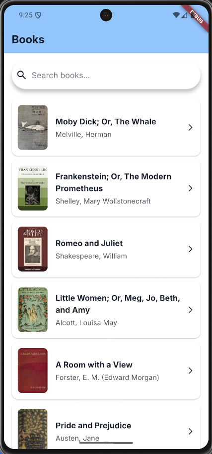
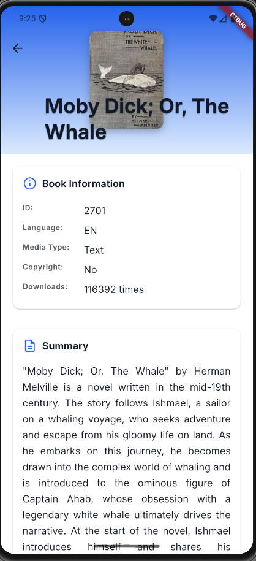
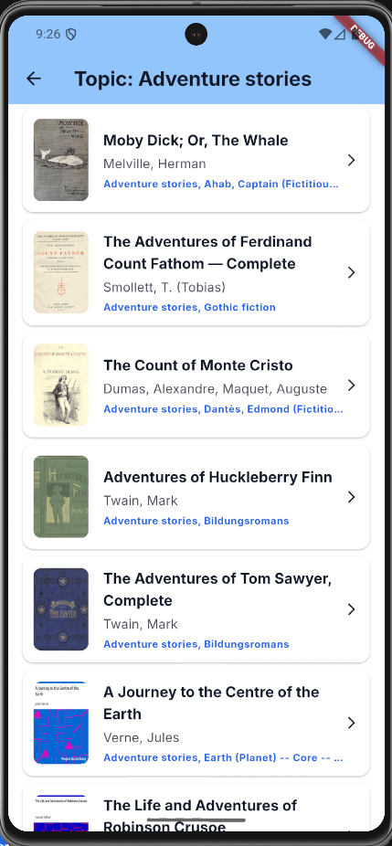

# Sample Book App

This is a simple Book App built using **Flutter**, designed with **Riverpod** as the state management solution, and structured using **Clean Architecture** and **MVVM (Model-View-ViewModel)** design principles. The app fetches list of book from the gutendex API,providing an example of how to integrate external APIs into a clean and maintainable Flutter application.

## Screenshots

<p align="center">
  
  
  
</p>

## Features

- Browse a list of books
- View detailed information about each book
- See author information and their published works
- Clean, Material Design interface
- Localization support
- Loading states with skeleton animations
- Theme support with custom fonts

## Architecture

This project follows **Clean Architecture** principles to ensure separation of concerns, maintainability, and testability. The architecture is organized into three main layers:

### 1. Presentation Layer
- **Pattern**: MVVM (Model-View-ViewModel)
- **State Management**: Riverpod with code generation
- **Responsibility**: UI components, screens, and user interaction handling
- **Location**: `lib/presentation/`

### 2. Domain Layer
- **Responsibility**: Business logic, entities, and repository interfaces
- **Independence**: Pure Dart code with no external dependencies
- **Location**: `lib/domain/`

### 3. Data Layer
- **Responsibility**: Data sources, repository implementations, and data models
- **Components**: Remote data sources, local data sources, repository implementations
- **Location**: `lib/data/`

### Project Structure
```
lib/
├── core/                 # Shared utilities, constants, and base classes
├── data/
│   ├── data_sources/     # API clients and data sources
│   │   ├── local/        # Local storage implementations
│   │   └── remote/       # HTTP clients and API services
│   └── repositories/     # Repository implementations
├── domain/
│   ├── entities/         # Business objects
│   └── repositories/     # Repository interfaces
└── presentation/
    ├── screens/          # UI screens
    └── widgets/          # Reusable UI components
```

## Dependencies

### Core Dependencies
- **flutter_riverpod**: State management with dependency injection
- **dio**: HTTP client for API communication
- **freezed**: Immutable data classes with code generation
- **json_annotation**: JSON serialization support

### UI & UX Dependencies
- **cupertino_icons**: iOS-style icons
- **skeletonizer**: Loading skeleton animations
- **url_launcher**: Opening external URLs

### Internationalization
- **flutter_localizations**: Flutter's built-in localization
- **intl**: Internationalization and formatting

### Development Dependencies
- **riverpod_generator**: Code generation for Riverpod providers
- **json_serializable**: JSON serialization code generation
- **build_runner**: Dart code generation runner
- **mockito**: Mocking framework for unit tests
- **flutter_lints**: Recommended linting rules

## Getting Started

### Prerequisites
- Flutter SDK (>=3.7.0)
- Dart SDK (>=3.7.0)

### Installation
1. Clone the repository
2. Install dependencies:
   ```bash
   flutter pub get
   ```

3. Generate code (if needed):
   ```bash
   flutter packages pub run build_runner build
   ```

### Development Commands
- **Run the app**: `flutter run`
- **Run tests**: `flutter test`
- **Code analysis**: `flutter analyze`
- **Build APK**: `flutter build apk`

## Credits
The images used in this project are credited to:
- [Book free icon](https://www.flaticon.com/free-icon/book_3330317?term=books&page=1&position=47&origin=search&related_id=3330317) by Flaticon

## Contributing
Feel free to submit issues or contribute to the project by creating pull requests. All contributions are welcome!

---

## License
This project is licensed under the MIT License. See the `LICENSE` file for details.

---

## Contact
For any questions or feedback, feel free to reach out to [Lucgudev](https://github.com/Lucgudev).